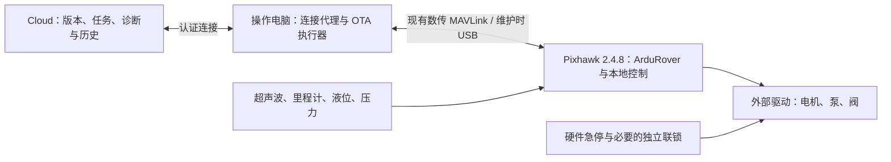

# 机器人代码与 OTA 架构审查

日期：2026-09-25。审查基线：`3549493579aee42b6b07328094543d39838af284`，包括本地已暂存的 FEAT-011 设计文件。用户本次明确硬件为 **Pixhawk 2.4.8 + 操作电脑 + Cloud**，没有 Raspberry Pi 或其他车载 companion computer。

本报告基于仓库代码、原始报告的文本提取、硬件和安全文档、验证记录、实际运行校验与内存反例。未连接车辆、上传参数、执行喷洒或刷写固件；本次没有执行真实 ArduRover SITL。以下区分已复现代码问题、协议不匹配和待验证的集成能力。

## 结论与质量评价

仓库具备较好的需求整理和合同测试基础，但尚未形成可部署的完整机器人控制系统。最需要改进的是：让测试独立验证真实协议和安全行为，并将规则接入实际飞控执行路径。

优点：路线/硬件/任务/验证分目录；明确外部驱动、硬件急停、清水测试边界；较新的校验器检查有限数值、类型、引用路径和状态转换；标准库依赖少，复现成本低；FEAT-010 已有缺失遥测字段的反例测试。

不足：导出器和测试重复同一套编号、命令顺序假设，因此错误可以一起通过；运行时控制器、传感器适配、电脑连接服务和云端 OTA 尚未实现；许多 PASS 只代表合同一致。原始报告中的“无需写代码即可沿墙居中”“绝不会卡死”等断言没有本仓库的运行证据支撑，应作为待验证目标。

| 评估项 | 当前判断 |
| --- | --- |
| 需求覆盖 | 有较完整目录，存在跨文档冲突 |
| Python 可读性 | 命名清楚，后期校验器输入检查较严谨；重复和硬编码较多 |
| 协议与硬件适配 | 有明确错误，缺少固定固件版本及板卡能力清单 |
| 故障安全 | 有设计规则，尚无完整实机执行和断链证据 |
| 测试可信度 | 合同回归可用，协议互操作和真实闭环覆盖不足 |
| OTA 完整度 | FEAT-011 设计阶段；还不是可用功能 |

## 具体发现

P1 表示上车前或相关功能交付前应优先修复；P2 表示影响验证可信度或后续维护。优先级不是实机事故已发生的声明。

### R1 — P1：MAVLink 继电器编号偏移，可能误控急停切断输出

位置：`scripts/export-mission-files.py:75`、`:81`、`:87`；`missions/cucumber-row-mission.v0.json:30`；对应测试 `scripts/validate-mission-exports.py:49`。

硬件使用 RELAY1=左阀、RELAY2=右阀、RELAY3=搅拌、RELAY4=急停切断命令。导出器将硬件编号 1、2、3 原样填入 `MAV_CMD_DO_SET_RELAY`。但 MAVLink 继电器从 0 开始：这些命令实际寻址第二、第三、第四路。因此左阀指令会寻址右阀，搅拌指令会寻址切断通道，第一路没有被正常寻址。实际电气效果还取决于驱动极性和引脚配置，但寻址错误明确存在。

建议：在协议适配边界统一转换 `mavlink_relay_index = relay_number - 1`；安全继电器不得出现在普通喷洒命令集合。测试必须独立断言预期的 0/1/2 及物理角色，不能只与导出算法做同构比较。

依据：[ArduPilot Relay Switch](https://ardupilot.org/rover/docs/common-relay.html) 明确说明 MAVLink 使用 0–5 编号。

### R2 — P1：参数文件没有正确配置 AUX 继电器模式，也未绑定固件版本

位置：`hardware/pixhawk-ardurover-sprayer.param:4`；`hardware/pixhawk-actuator-mapping.v0.json` 的 parameters；`scripts/validate-pixhawk-mapping.py:130` 附近。

文件设置 `BRD_PWM_COUNT=4`，又把 AUX2/3/4 当 GPIO 使用。在使用旧参数机制的 Pixhawk 固件上，前四个 AUX 是 PWM，只有最后两个为 GPIO。现代固件则通过对应的 `SERVOx_FUNCTION=-1` 配置 GPIO；当前文件没有这些配置，也没有现代 relay function 设置。当前测试只确认两份仓库文件一致，不能确认飞控接受并正确驱动。

建议：先读取真实板卡类型、可用 Flash、bootloader、ArduRover 版本与完整参数，固定一个受支持配置。分别生成该版本的 GPIO/relay 参数、启动安全状态和输出极性，导入后回读并重启验证。不要只把 BRD_PWM_COUNT 改为另一个值就假定适用于所有版本。

依据：[Pixhawk GPIO 旧机制](https://ardupilot.org/rover/docs/common-pixhawk-overview.html)、[现行 GPIO 配置](https://ardupilot.org/rover/docs/common-gpios.html)、[Relay 设置](https://ardupilot.org/rover/docs/common-relay.html)。

### R3 — P1：WPL 导出把 pump-off 写进保留的 HOME 序号

位置：`scripts/export-mission-files.py:169`；`missions/exports/cucumber-row-mission.waypoints:2`。

导出 sequence 已跳过 HOME，WPL 却从序号 0 开始写，第一行是 `DO_SET_SERVO 9 1000`。ArduPilot mission 的序号 0 用作 HOME。按原序号上传时，第一条安全关泵指令不能作为普通任务项保存/执行；地面站若解释第 0 行为 HOME，也会失去正确的 HOME 行。QGC 的 plannedHomePosition 和 WPL 的 HOME 表达不能直接共用同一条数目规则。

建议：WPL 单独写入合法 HOME 行，从 1 开始编号任务命令；分别验证两种格式。增加 Mission Planner/兼容解析器导入导出，以及 SITL 上传后下载回读测试，确认首条实际任务仍然是关泵。

依据：[ArduPilot AP_Mission 源码](https://raw.githubusercontent.com/ArduPilot/ardupilot/master/libraries/AP_Mission/AP_Mission.cpp) 的 index 0 特殊处理。本次是文件及源码审查，未进行地面站实际导入。

### R4 — P1：喷洒边界按列表顺序编排，没有满足 NAV/DO 的执行语义

位置：`scripts/export-mission-files.py:93`；`scripts/validate-mission-exports.py:56`。

WP003 标记喷洒起点，但对应开泵/开阀命令排在 WP003 NAV 前面、WP002 NAV 后面。ArduPilot 将 DO 命令与前一个 NAV 关联，不能把这组命令理解为“到达 WP003 才开始喷洒”。短距离航点还可能让尚未执行的 DO 被跳过。这使实际喷洒区间与 WP003→WP004 的设计不一致，任务中出现 OFF 文本也不能证明关闭必然执行。

建议：先明确每个区间入口、退出和允许喷洒的到达条件，再按目标固件语义生成 NAV/DO/条件或运行时状态机。用真实 SITL 记录位置、任务序号和输出变化，验证对齐段绝不喷洒、退出边界必定关闭。不能仅交换两行而跳过时序验证。

依据：[ArduPilot Mission Commands](https://ardupilot.org/rover/docs/common-mavlink-mission-command-messages-mav_cmd.html)。

### R5 — P1：定位安全判断漏掉横向偏移及相对路线的航向错误

位置：`scripts/validate-position-confidence.py:240`、`:280`、`:285`。

程序检查左右距离之和是否接近行宽，但距离之和不说明车辆是否居中。复制正常场景，将左右距离改为 0.20/1.00 m，总和仍为 1.20 m，返回 `RTK_CONFIDENT / AUTO / spray_allowed=true`。在该模型对称安装假设下，偏移为 0.40 m，超过安全文档的 0.30 m 阈值。

此外，expected_heading_deg 只被检查是不是数值；IMU 与里程计都改为 180°、路线期望仍为 0°时，仍返回允许喷洒。传感器互相一致不能替代与路线对齐的检查。

建议：加入经安装偏置修正的横向误差、车宽/边界净距、相对路线航向误差，以及 IMU/里程计/超声波各自的新鲜度。反例需覆盖偏向两侧、反向行驶、相同错误读数与数据冻结。

### R6 — P1：恢复时没有累计故障解除消息的年龄

位置：`scripts/validate-fault-recovery-telemetry.py:584`、`:725`。

FAULT_CLEAR 只保存上报的 clear_event_age_s；RECOVERY_DECISION 比较这个固定值与阈值，没有加入期间经过的时间。实测将解除故障之后的事件整体推迟 10 秒，解除到恢复决策相隔 10.4 秒，配置最大年龄 2 秒，整个场景仍验证成功且 resume_allowed=True。

建议：保存解除消息对应的本地单调时间或采样时间，在决策时重新计算年龄；定位证明也须重新检查新鲜度。恢复应同时确认所有当前故障均已解除，并重新执行所需 preflight，不能靠历史成功状态。

### R7 — P1：启动前检查使用喷洒中的压力范围，遗漏必需的电量和链路检查

位置：`sitl/preflight-dosing.v0.json:34`；`scripts/validate-preflight-dosing.py:134`；对照 `docs/safety-contract.md:37`。

安全文档要求泵关闭时检查 0 PSI 附近的静态压力；合同却要求启动前 30–60 PSI。实测 healthy E-stop/液位、pressure_psi=0 被阻止启动。相反，只要压力为 40 PSI，附带 battery_voltage=0、telemetry_rssi=0 仍得到空 blocker 列表。这些新增字段只是反例输入，不代表当前接口已有电池适配；问题在于接口完全没有落实文档要求。

建议：明确 SAFE_IDLE→PREFLIGHT→PRIMING→READY→SPRAYING，各状态检查不同压力条件；预充阶段有超时、限压和安全回退。将电池、链路、传感器新鲜度和输出反馈列为必需输入，缺失就阻止启动。零速度还应有明确的零流量安全结果：当前校验直接用 0.1 L/min 的正最小流量拒绝零速场景。

### R8 — P1：SITL 和故障关断的现有证据不足以支持机器人行为已验证

位置：`scripts/simulate-mission-contract.py:64`；`simulation/README.md:61`；FEAT-008/009/010 验证文件。

轻量模拟器把 fault_state 直接赋值为 SAFE_OUTPUT，再断言它等于 SAFE_OUTPUT，没有调用独立控制实现。SITL 记录证明了程序构建并启动到 Waiting for connection；后续功能主要读 JSON 场景，没有在任务中向 ArduRover 注入故障、观察实际继电器/PWM、验证断链及恢复。当前目录也没有实际部署的传感器适配器或关泵控制服务。

建议：保留这些合同测试，但分开标注 contract_verified、sitl_verified、bench_verified。增加固定版本 ArduRover SITL 的任务上传、真实消息、输出回读、障碍物、通信中断、异常模式、断电重启的验证。对于电脑停止工作后必须关泵的行为，执行保障必须在飞控或独立硬件一侧，并实测延迟。Cloud 不能承担此实时责任。

### R9 — P1：OTA 设计依赖不存在的车载电脑，未覆盖完整固件更新与可执行恢复

位置：`stage-gates/active/FEAT-011/02-tech-design.md:9`、`:87`、`:115`。

现有 FEAT-011 将 companion computer 作为连接功能的前提，与用户确认的配置不符。仓库当前没有 connected 目录、OTA runner、电脑连接代理或云端服务。设计覆盖参数、任务、路由、标定、companion 包等，但没有完整的 Pixhawk 固件更新路径；rollback metadata 也不等于恢复代码和断电恢复能力。

建议：将采集/诊断/更新服务放到现有操作电脑，下面给出目标流程。参数/任务更新和固件刷写分别验收。实际 2.4.8 板卡的 bootloader、Flash 容量、端口及无线透传能力尚未确认，不能承诺固件可经现有电台无线刷写，也不能承诺固件双分区自动回滚。官方 SD 卡自动更新路径目前针对部分 H7 板，不能直接套到 F4 Pixhawk 2.4.8。

依据：[ArduPilot 固件加载](https://ardupilot.org/rover/docs/common-loading-firmware.html)、[Bootloader](https://ardupilot.org/dev/docs/bootloader.html)、[SD 卡更新限制](https://ardupilot.org/rover/docs/common-install-sdcard.html)。

### R10 — P2：验证门禁会静默跳过缺失脚本；标记 PASS 没有调用实际校验

位置：`scripts/check-gate.sh:7` 及后续 `-x` 条件；`scripts/update-feature.py:63`。

required validator 不存在或失去执行位时，shell 条件会跳过它。update-feature.py 只检查四个 gate 文件和 STATUS: PASS，并不执行各校验器。只要文档仍 PASS，缺失验证能力就可能被当作已通过。当前 FEAT-011 的 FAIL 还导致完整 gate 在中途退出，后续旧功能测试不会执行；本次已独立逐个运行补足审查。

建议：单独维护必跑检查清单，缺失即 FAIL；运行结果与提交/输入版本关联。把“全部检查通过”与“人工状态记录”分开，状态更新读取可信的本次运行结果。CI 应验证导出产物与生成器同步，并固定 Python/ArduRover 版本。

## 符合现有硬件的目标架构



这是建议的职责划分，传感器接入和飞控内自定义功能仍须实现与验证。电脑离线时，Cloud 无法透过它访问飞控；Cloud 断网时电脑应能完成本地安全操作和缓存日志。电脑与飞控断链时，由已验证的飞控/硬件规则停止所需执行器。电脑的网络重试不得阻塞控制和日志线程。

Pixhawk 2.4.8 的 F4/内存限制影响实现路径。现行官方 Lua 文档明确 F4 不提供 scripting 支持；必须读取实际板卡和已装固件的能力，不能将“以后补 Lua”作为默认答案。自定义行间居中和喷洒安全逻辑若不能由已验证的原生功能实现，就应做受控的 ArduRover 固件扩展并维护对应 SITL 测试。用户的硬件限制应贯穿设计，不应默默增加 Raspberry Pi。

依据：[Pixhawk 资源限制](https://ardupilot.org/rover/docs/common-pixhawk-overview.html)、[Lua 支持条件](https://ardupilot.org/rover/docs/common-lua-scripts.html)。官方[避障功能](https://ardupilot.org/rover/docs/common-object-avoidance-landing-page.html)的存在不能单独证明本项目的双侧沿行居中已实现。

## OTA 必需的完整流程

1. Cloud 创建版本化发布物：目标设备/板型、固件兼容范围、参数/任务版本、长度和 hash，以及可验证来源。hash 校验用于检查内容一致性；上线链路还需要认证和发布物来源验证。
2. 电脑代理下载到暂存区并完整校验；job_id 幂等处理，超时/重连不会重复应用同一更新；同一车辆只有一个更新事务。
3. 获取新鲜的飞控状态，确认停稳、disarmed、喷洒关闭、电源合适；进入禁止启动的维护状态，并持续监控条件，而非只在下载开始前检查一次。
4. 保存完整旧参数/任务、版本和硬件身份，记录事务进度。参数逐项写入后回读；任务上传有 ACK，随后下载比较。部分应用失败时进入维护故障状态，禁止带着混合版本运行。
5. 健康检查通过才标记完成；失败执行已实现的参数/任务恢复，并重新回读。电脑进程退出、无线中断、飞控重启之后，靠持久化事务记录判断下一步，不能凭内存变量继续。
6. Cloud 保存旧/新版本、结果、失败原因、诊断包和下一次运行对比，保留审计历史。电脑本地有容量上限、上传重试和数据优先级，避免“保留所有原始数据”填满磁盘。
7. Pixhawk 固件更新另设流程：目标板/镜像匹配、bootloader 可达性、稳定供电、刷写后版本/参数迁移验证、失败后本地恢复。若无线链路不支持刷写，则明确通过电脑 USB 维护刷写；仍可由 Cloud 管理发布和结果，但不能把这描述为飞控端无线 OTA 已完成。

飞控应用固件更新属于整体目标，不能以“支持参数更新”代替它。当前能力标签建议分为 PC 软件更新、参数更新、任务更新、飞控固件更新，分别显示 planned/validated/available。

## 机器人专项改进

- 先修 R1–R4，确定真实引脚、编号、输出极性、任务边界及固件兼容性。
- 为实际控制器建立统一喷洒许可：当前状态、有效速度、位置、压力/液位、链路策略、人工接管和更新锁共同决定；所有异常分支都验证 pump/valve 输出。
- 将定位判断作为可测试规则模块，实际传感器时间戳及安装几何由适配层提供。加入滤波、故障锁存、恢复滞回，避免湿叶回波使 AUTO/HOLD 高频跳变。
- 速度同步施用量计算目前只有目标公式，导出仍固定 1450 PWM。应通过实测压力—流量—PWM 数据标定，按单侧/双侧分别控制，处理低速、停车、堵塞、泄漏和执行器饱和。没有流量反馈时应明确估算误差。
- 防重复喷洒账本目前是内存中的 unsprayed/sprayed 状态。中途停电可能发生“已喷但尚未记录”；应记录部分区间、版本、实际累计量和不确定状态，恢复时对不确定区域进行人工确认，不能宣称已实现物理上的 exactly-once。
- 导出器与测试可以共享解析工具，但预期协议值和关键安全边界应来自独立测试向量或 SITL 观测。新增测试优先针对本报告反例、断链、重启和错误版本；不要只增加更多结构相同的正常 JSON。

## 本次实际验证

环境：Windows，Python 3.12.5，使用 Git for Windows Bash 执行完整 gate。

逐一运行 `scripts/validate-*.py` 和 `scripts/simulate-mission-contract.py`，共 10 个，全部退出码 0。完整 `scripts/check-gate.sh` 退出码 1，因为 active FEAT-011 的验证状态仍为 FAIL；这是已知未完成工作，不是本次审查造成的回归。

关键真实输出：

```text
PASS: preflight dosing contract validated
Validated scenarios: 3 (1 safe, 2 blocked)
PASS: position confidence contract validated
Validated scenarios: 6 (2 continue, 4 safe_hold)
PASS: fault recovery telemetry contract validated
Validated scenarios: 5 (3 complete, 3 hold-entered, 2 resume/continue decisions)
Negative telemetry cases: 2
MISSION_EXPORT_VALIDATION_OK
SOURCE_ITEMS=7 EXPORT_ITEMS=28 WAYPOINTS=6
FAIL: verification gate status must be PASS
FULL_GATE_EXIT=1
```

反例均导入现有脚本，对 deepcopy 的场景运行函数，没有修改产品输入文件。定位反例使用 FEAT-009 第一个正常场景，其余输入保持不变：

```text
lateral_offset_0.40m {"decision": "RTK_CONFIDENT", "mode": "AUTO", "spray_allowed": true, "safe_outputs_required": false, "reason_codes": []}
heading_180deg_from_route {"decision": "RTK_CONFIDENT", "mode": "AUTO", "spray_allowed": true, "safe_outputs_required": false, "reason_codes": []}
speed_zero {"decision": "RTK_CONFIDENT", "mode": "AUTO", "spray_allowed": true, "safe_outputs_required": false, "reason_codes": []}
idle_pressure_zero_blockers ['pressure_in_bench_range']
battery_zero_rssi_zero_blockers []
max_fault_clear_age_s 2.0
elapsed_since_clear_s 10.399999999999999
declared_clear_age_s 0.4
accepted_result {'id': 'recoverable_obstacle_resume_tail_and_complete', 'expected_outcome_type': 'MISSION_COMPLETE_AFTER_RECOVERY', 'final_state': 'MISSION_COMPLETE', 'mission_complete': True, 'resume_allowed': True, 'duplicate_spray_suppressed': False, 'hold_entered': True, 'sprayed_once_units': ['row_01_left_spray_head', 'row_01_left_spray_tail']}
```

复现方法：定位调用 `validate_thresholds(contract)` 后调用 `evaluate_scenario(scenario, thresholds)`；依次仅修改左右距离为 0.20/1.00、IMU/里程计航向为 180/180、速度为 0。preflight 调用 `expected_blockers`，分别将正常场景压力改为 0，或增加 battery_voltage=0 和 telemetry_rssi=0。恢复使用 FEAT-010 第一个场景，所有 seq 大于 FAULT_CLEAR 的 timestamp_s 加 10，然后按 main 中相同的初始化顺序调用 `validate_scenario`。

零速定位输出是模块联动风险，不能单凭它断言实体泵会启动；当前尚无整体运行控制器。R5 的横向/航向放行与 R6 的过期恢复放行则已在对应安全判断代码中明确复现。

建议下一轮先落实目标板卡/固件清单及 R1–R7 的修复计划，再以真实 SITL 验证任务和断链安全，最后实现电脑端 OTA 事务和 Cloud 诊断闭环。硬件清单缺失部分由读取真实设备来补齐，不必重新编写整份项目报告。
